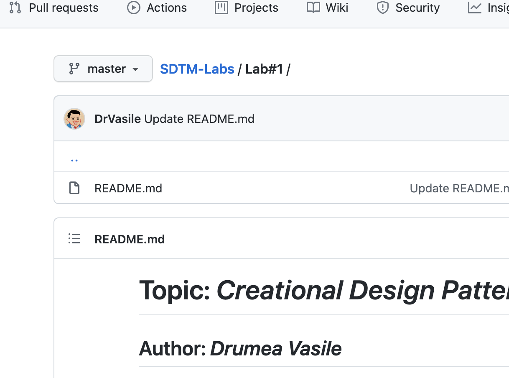

# Topic: *Creational Design Patterns*
## Author: *Drumea Vasile*
------
## Objectives:
__1. Study and understand the Creational Design Patterns.__

__2. Choose a domain, define its main classes/models/entities and choose the appropriate instantiation mechanisms.__

__3. Use some creational design patterns for object instantiation in a sample project.__

## Some Theory:
In software engineering, the creational design patterns are the general solutions that deal with object creation, trying to create objects in a manner suitable to the situation. The basic form of object creation could result in design problems or added complexity to the design. Creational design patterns solve this problem by optimizing, hiding or controlling the object creation.

Some examples of this kind of design patterns are:

   * Singleton
   * Builder
   * Prototype
   * Object Pooling
   * Factory Method
   * Abstract Factory
   
## Main tasks:
__1. Choose an OO programming language and a suitable IDE or Editor (No frameworks/libs/engines allowed).__

__2. Select a domain area for the sample project.__

__3. Define the main involved classes and think about what instantiation mechanisms are needed.__

__4. Based on the previous point, implement atleast 3 creational design patterns in your project.__

## Evaluation:
__1. The project should be located in a repository on a git hosting service (e.g. Github, Gitlab, BitBucket etc.):__

  * You only need to have one project
  * You can have separate modules that depend on each other
  * You should separate the project into modules / packages based on the responsibilities:
    * client
    * domain
      * factory
      * models (POJO ,DTO, DAO ,Entity)

__2. It should contain an explanation in the form of a README file or a LaTeX report with the standard structure from the TEMPLATE.md file.__

__3. In order to make the evaluation as optimal as possible we will have a quiz on this topic.__

__4. The mark of the lab is based on the project and the quiz.__

__5. Submit the repository URL on ELSE.__

__7. The deadline for this assignment is 03/10/2021.__

__8. After the deadline for each weak the max grade decreases by 1.__

